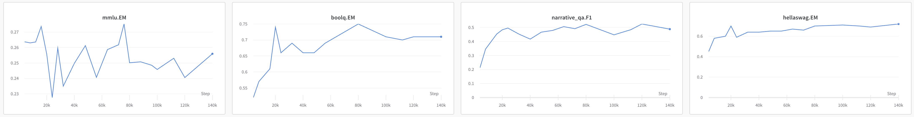
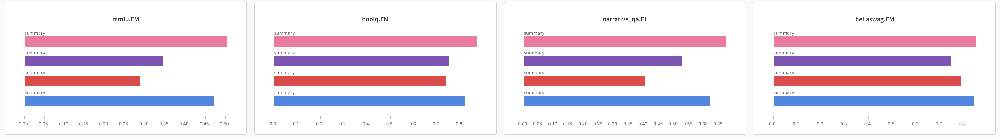

# 평가 결과 기록기

[`wandb_writer.py`](wandb_writer.py)를 사용하여 [W&B](https://wandb.ai/) (wandb)에 평가 결과를 기록하세요.

`wandb_writer.py`를 사용하면 다음을 수행할 수 있습니다:

- 모델의 평가 메트릭 변화를 시각화하여 교육 프로세스 중의 변화를 확인할 수 있습니다.

- 여러 모델의 메트릭을 비교할 수 있는 리더보드를 만들 수 있습니다.


## 사용법

```shell
python wandb_writer.py --config <config_file> [--print-only]
```

- `config_file`: 구성 파일 경로 (세부 사항은 [구성](#구성) 참조)
- `--print-only`: 결과를 명령 줄에만 출력하고 wandb에 기록하지 않습니다.

## 구성

세 가지 다른 경우에 대한 예제 파일을 [`config`](config) 폴더에 제공했습니다.

일반 형식은 다음과 같습니다:

```yaml
project: <str>   # wandb 프로젝트 이름
base_url: <str>  # wandb 인스턴스 URL
# 다른 특정 구성 항목들
```

### HELM 출력에서 파싱

다음 구성은 HELM 출력 폴더에서 평가 결과를 파싱하고 wandb에 기록하는 데 사용됩니다.

```yaml
# 일반 구성
# ...

evals:  # 기록할 평가
  - eval_type: helm    # 현재는 helm만 지원됨
    model_name: <str>  # 모델 이름
    source: helm  # helm 출력 디렉토리에서 파싱하여 사용
    helm_output_dir: <helm 출력 디렉토리 경로>
    helm_suite_name: <helm suite 이름>
    token_per_iteration: <10억 토큰 당 토큰 수>
    benchmarks:  # 기록할 벤치마크 메트릭, 아래는 예시입니다
      - name: mmlu
        metrics:
          - EM
      - name: boolq
        metrics:
          - EM
      - name: narrative_qa
        metrics:
          - F1
      - name: hellaswag
        metrics:
          - EM
      - ...
```

> `benchmarks` 필드가 제공되지 않으면 기본적으로 16개의 HELM 코어 메트릭을 사용합니다. 이 16개 메트릭은 다음과 같습니다:
>  ```
>  mmlu.EM, raft.EM, imdb.EM, truthful_qa.EM, summarization_cnndm.ROUGE-2, summarization_xsum.ROUGE-2, boolq.EM, msmarco_trec.NDCG@10, msmarco_regular.RR@10, narrative_qa.F1, natural_qa_closedbook.F1, natural_qa_openbook_longans.F1, civil_comments.EM, hellaswag.EM, openbookqa.EM
>  ```

### 구성 파일에서 파싱

메트릭의 점수는 구성 파일에서 직접 제공할 수 있으며, 다음은 예제입니다.

```yaml
# 일반 구성
# ...

evals:  # 기록할 평가
  - eval_type: helm
    model_name: llama-7B  # 모델 이름
    source: file  # 구성에서 파싱하여 사용
    token_num: 1000
    eval_result:  # 기록할 평가 결과
      mmlu:
        EM: 0.345
      boolq:
        EM: 0.751
      narrative_qa:
        F1: 0.524
      hellaswag:
        EM: 0.747
      ...
```

### 리더보드 만들기

다음 구성은 리더보드를 만드는 데 사용됩니다.

```yaml
# 일반 구성
# ...
leaderboard: True
leaderboard_metrics:  # 리더보드에 필요한 메트릭
  - mmlu.EM
  - boolq.EM
  - quac.F1
  - hellaswag.EM
  - ...
excluded_models:   # 리더보드에 참여하지 않을 모델
  - <제외할 모델>
  - ...
```

> `leaderboard_metrics` 필드가 제공되지 않으면 기본 리더보드 메트릭으로 16개의 HELM 코어 메트릭을 사용합니다. 이 16개 메트릭은 기본 벤치마크 메트릭과 동일합니다.
